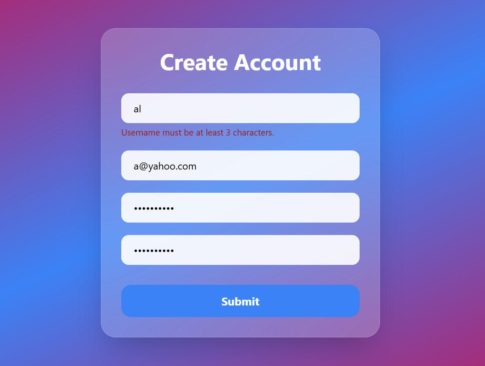

# React Form Validation

A simple and responsive React Form Validation project built with React, Vite, and Tailwind CSS. This project demonstrates how to validate user input using reusable validation functions and a reusable "InputField" component.

## 🚀 Features

- ✅ Username validation
- ✅ Email validation
- ✅ Strong password validation
- ✅ Confirm password matching
- ✅ Validation on "onBlur"
- ✅ Full form validation on submit
- ✅ Reusable "InputField" component
- ✅ Validation logic separated into utility functions
- ✅ Clean and responsive UI with Tailwind CSS

## 🛠️ Technologies Used

- React
- Vite
- JavaScript (ES6+)
- Tailwind CSS

## 📂 Project Structure

src/
│── components/
│   └── InputField.jsx
│
│── utils/
│   └── validation.js
│
│── App.jsx
│── main.jsx

## 📌 Validation Rules

### Username

- Required
- Minimum 3 characters

### Email

- Required
- Must be in a valid email format

### Password

- Required
- Minimum 8 characters
- At least one uppercase letter
- At least one lowercase letter
- At least one number
- At least one special character

### Confirm Password

- Required
- Must match the password

## 💡 What I Learned

- Managing form state with "useState"
- Creating reusable React components
- Separating business logic from UI
- Form validation using utility functions
- Handling "onChange", "onBlur", and "onSubmit"
- Writing cleaner and more maintainable React code

📸 Preview

## Future Improvements

- Show/Hide Password
- Password strength indicator
- Real-time validation
- Dark mode
- Connect with a backend API

---

Made with ❤️ using React.